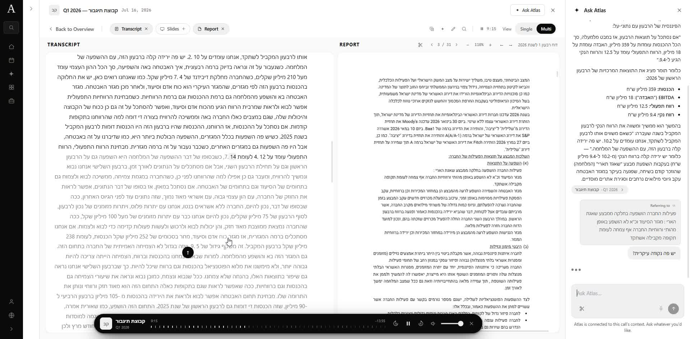

# Atlas

An investor research workspace for the Israeli public market. Atlas brings live investor calls, Hebrew transcripts, PDF reports, and contextual AI analysis into one place.

[Watch the product walkthrough](https://sagi-argaman-portfolio.vercel.app/#atlas) · [Codebase map](ARCHITECTURE.md)



## The product

Atlas started with a gap in access to live transcripts of Israeli company investor calls. The workflow lets an investor follow the call inside the platform, read its transcript, view a report alongside it, and select passages to discuss with an LLM without moving between tools.

- **Live calls and replay:** synchronized audio and captions, followed by a formatted transcript when a call finishes.
- **Reports beside the conversation:** a multi-view reader for transcripts, PDF reports, and presentations.
- **Ask Atlas:** contextual questions over a call, company, or selected report passage, including snipped report images.
- **Israeli company research:** issuer profiles, filings, and calendar data from the TASE MAYA feed, with Hebrew and English interfaces.

Built by Sagi Argaman. This repository includes the application, tests, database migrations, and the development decisions behind it.

## Where to start in the code

| Area | Entry point | Responsibility |
| --- | --- | --- |
| Application | [`src/app/app`](src/app/app) | Next.js App Router pages and persistent research shell |
| Live calls | [`src/lib/live`](src/lib/live) | Timing, audio chunks, transcript synchronization, and finishing a call |
| AI chat | [`src/app/api/chat/v2/route.ts`](src/app/api/chat/v2/route.ts), [`src/lib/chat2`](src/lib/chat2) | Authenticated, scoped requests and streamed responses with citations |
| Retrieval | [`src/lib/corpus`](src/lib/corpus) | Chunking, embeddings, indexing, and retrieval |
| Company filings | [`src/lib/maya`](src/lib/maya) | MAYA data access and filing synchronization |
| Data layer | [`supabase/migrations`](supabase/migrations) | Postgres schema evolution and access policies |

**Stack:** Next.js 14, React 18, TypeScript, Tailwind CSS, and Supabase for Postgres, authentication, and storage. Live ingestion uses Recall.ai / IVRIT; transcription also supports OpenAI. The v2 chat route uses Anthropic; other transcription and workspace paths use Gemini and OpenAI. Provider setup depends on the feature being run.

## Local development

Use Node.js 24 and npm. Start by installing the locked dependencies:

```sh
npm ci
```

For a source-level review, these checks need no production credentials:

```sh
npm test
npx tsc --noEmit
```

To run the application, copy `.env.example` to `.env.local` and configure your own services:

| Feature | Configuration |
| --- | --- |
| Sign-in and data | `NEXT_PUBLIC_SUPABASE_URL`, `NEXT_PUBLIC_SUPABASE_ANON_KEY`, `SUPABASE_SERVICE_ROLE_KEY` |
| Ask Atlas v2 | `ANTHROPIC_API_KEY` |
| Transcription / workspace model calls | `OPENAI_API_KEY`, `GEMINI_API_KEY`; optional `RUNPOD_API_KEY` and `RUNPOD_IVRIT_ENDPOINT_ID` |
| Live-call ingestion | `RECALL_API_KEY` and a separately configured live engine; see [`docs/live-engines.md`](docs/live-engines.md) |

Keep service-role and model-provider keys server-side. Use a separate development Supabase project. The migrations record changes to an existing database; they are **not a verified blank-database bootstrap**, and production data is not included in this repository. A working app session requires Supabase authentication and a compatible schema.

```sh
npm run dev
# Open http://localhost:3000
```

Media ingestion also needs FFmpeg and yt-dlp. The Linux build helper downloads yt-dlp; Windows developers must provide `bin/yt-dlp.exe`. Production compilation uses `npm run build`; unlike the source checks above, it needs configured service variables and has not been made into an isolated, credential-free build.

## Verification and current limits

GitHub Actions runs the existing test suite and TypeScript checks on pushes and pull requests. The suite covers domain logic and boundaries such as authentication, ownership, transcript timing, request scope, and streamed-chat completion. It does not establish live provider availability or end-to-end transcription quality. Provider-backed evaluations live under [`scripts/retrieval-eval`](scripts/retrieval-eval).

This is an evolving product. The recorded [product status](STATUS.md) distinguishes working surfaces from unfinished work: Agents has foundations but no usable run flow, and market-wide chat retrieval has outstanding issues. The walkthrough demonstrates the research workflow; it is not a claim that every surface is complete. Live calls use buffering, so captions are not zero-latency.

For deeper review, see [architecture](ARCHITECTURE.md), [decisions](DECISIONS.md), and [progress](PROGRESS.md). Internal planning and historical notes remain in the repository for traceability; this README is the starting point for a new reader.
